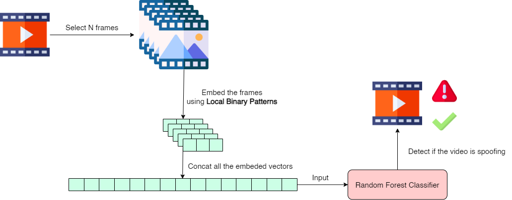

# Our pipeline

# Running steps
- To download and process data, run:
```
python preprocessdata.py
```
- Then, we train our Random Forest Classifier model:
```
python train.py
```
- To see how to use our model, let's check the following code, with input is the string of the path to the video, and out is either 0 or 1.
```
from utils import file2class
result = file2class('pat/to/file/name')
```
- Use ```demo.py``` in order to generate a csv file from public test. You have to download the public test and extract first.